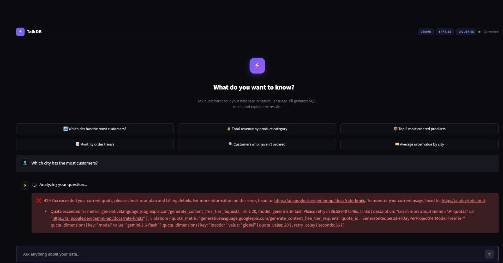
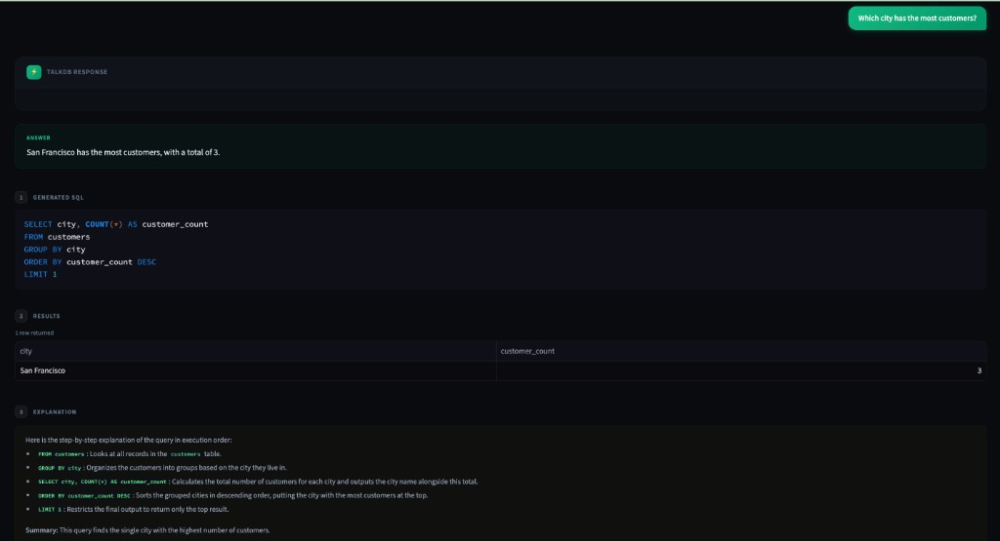
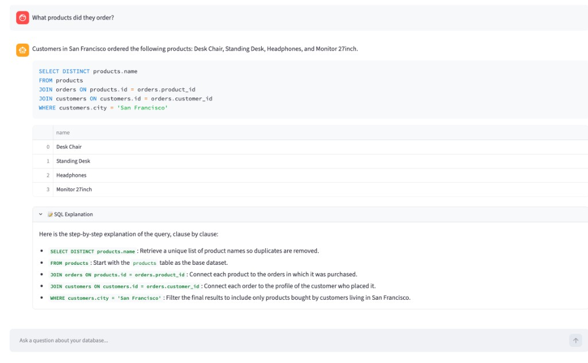
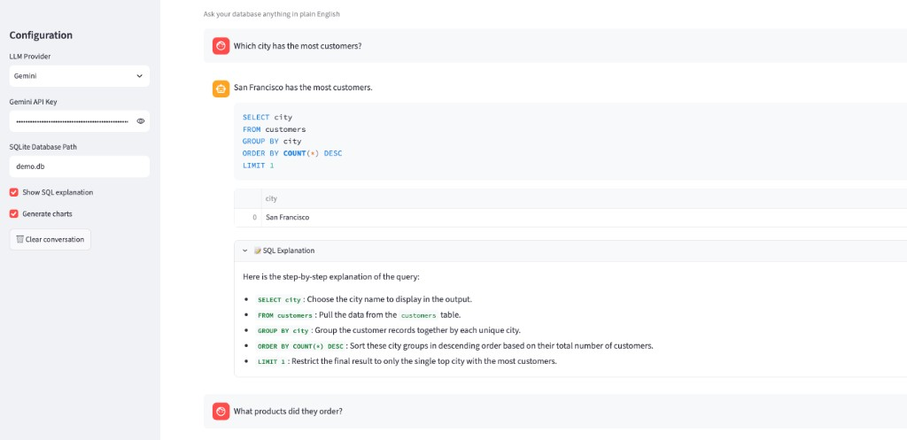

# TalkDB

Talk to your database in plain English. TalkDB converts natural language questions into SQL using RAG (Retrieval-Augmented Generation) with conversation memory, query caching, SQL explanations, and auto-visualization.

## Screenshots

### Welcome Screen


### Query Response — Answer + SQL + Results + Explanation


### Conversation Memory — Follow-up Questions
> User asks *"Which city has the most customers?"* → then *"What products did they order?"* — TalkDB resolves "they" to San Francisco automatically.



### SQL Generation with Schema Explorer


## Features

- **Natural Language to SQL** — Ask questions in English, get SQL + results + a plain-English answer
- **Conversation Memory** — Follow-up questions like *"now filter those by price > 50"* just work
- **Query Caching** — Repeated questions skip the LLM call entirely (LRU cache)
- **SQL Explanation** — Get a plain-English breakdown of every generated query
- **Auto Visualization** — Plotly charts generated automatically from query results
- **Streamlit Web UI** — Interactive chat interface for demos
- **Pluggable Architecture** — Swap LLMs, vector stores, and databases via clean interfaces
- **SQL Safety** — Only SELECT queries are allowed; all SQL is validated before execution

## Architecture

```
┌───────────────────────────────────────────────────────┐
│                     TalkDB Engine                     │
│                                                       │
│  ┌──────────┐  ┌──────────────┐  ┌─────────────────┐ │
│  │   LLM    │  │ Vector Store │  │    Database      │ │
│  │ Adapter  │  │   Adapter    │  │    Adapter       │ │
│  └────┬─────┘  └──────┬───────┘  └───────┬─────────┘ │
│       │               │                  │           │
│  ┌────┴─────┐  ┌──────┴───────┐  ┌───────┴─────────┐ │
│  │ OpenAI   │  │  ChromaDB    │  │  SQLite         │ │
│  │ Gemini   │  │  FAISS       │  │  PostgreSQL     │ │
│  └──────────┘  │  Qdrant      │  └─────────────────┘ │
│                └──────────────┘                       │
│                                                       │
│  ┌─────────────┐ ┌──────────┐ ┌────────────────────┐ │
│  │ Conversation│ │  Query   │ │  SQL Explanation   │ │
│  │   Memory    │ │  Cache   │ │  + Plotly Charts   │ │
│  └─────────────┘ └──────────┘ └────────────────────┘ │
└───────────────────────────────────────────────────────┘
```

## Quick Start

### Installation

```bash
pip install poetry
cd TalkDB
poetry install
```

### Basic Usage

```python
from talkdb import TalkDB
from talkdb.llms import OpenAILLM
from talkdb.vectorstores import ChromaVectorStore
from talkdb.databases import SQLiteDatabase

# 1. Set up components
llm = OpenAILLM(api_key="your-api-key")
vectorstore = ChromaVectorStore()
database = SQLiteDatabase()
database.connect(db_path="your_database.db")

# 2. Create engine
engine = TalkDB(llm=llm, vectorstore=vectorstore, database=database)

# 3. Index your schema (one-time)
engine.index_all_ddls()

# 4. Ask questions
result = engine.ask("What are the top 5 most expensive products?")
print(result.sql)        # The generated SQL
print(result.dataframe)  # pandas DataFrame with results
print(result.answer)     # Natural language answer
```

### Conversation Memory

```python
result1 = engine.ask("Show all orders from last month")
result2 = engine.ask("How many of those were above $100?")
# TalkDB remembers context — resolves "those" from the previous turn

engine.clear_history()  # Reset when switching topics
```

### SQL Explanation Mode

```python
result = engine.ask("Show revenue by category", explain=True)
print(result.explanation)
# "1. SELECT category and SUM of revenue FROM sales
#  2. GROUP BY category to aggregate per category
#  3. ORDER BY revenue descending"
```

### Auto Visualization

```python
result = engine.ask("Monthly sales trend", visualize=True)
result.chart.show()  # Opens an interactive Plotly chart
```

### Query Caching

Repeated questions are served from cache — no LLM call, instant results:

```python
result1 = engine.ask("Total revenue")    # Calls LLM
result2 = engine.ask("Total revenue")    # Served from cache — instant
engine.clear_cache()                     # Reset cache when data changes
```

### Streamlit Web UI

```bash
poetry run streamlit run app.py
```

### Using Google Gemini

```python
from talkdb.llms import GeminiLLM

llm = GeminiLLM(api_key="your-gemini-key", model="gemini-pro")
engine = TalkDB(llm=llm, vectorstore=vectorstore, database=database)
```

### Using Qdrant (Production)

```python
from talkdb.vectorstores import QdrantVectorStore

# Local embedded mode
vectorstore = QdrantVectorStore(path=".talkdb_qdrant")

# Or connect to a Qdrant server
vectorstore = QdrantVectorStore(url="http://localhost:6333")
```

### Using FAISS (In-Memory, Fast)

```python
from talkdb.vectorstores import FAISSVectorStore

vectorstore = FAISSVectorStore()
```

### PostgreSQL

```python
from talkdb.databases import PostgresDatabase

database = PostgresDatabase()
database.connect(host="localhost", database="mydb", user="postgres", password="secret")
```

### Indexing Few-Shot Examples

```python
# Single example
engine.index_example(
    question="How many users signed up this week?",
    sql="SELECT COUNT(*) FROM users WHERE created_at >= date('now', '-7 days')"
)

# Bulk examples
engine.index_examples_from_list([
    {"question": "Show active users", "sql": "SELECT * FROM users WHERE is_active = 1"},
    {"question": "Total revenue", "sql": "SELECT SUM(amount) FROM payments"},
])
```

## Project Structure

```
TalkDB/
├── app.py                          # Streamlit web UI
├── pyproject.toml                  # Dependencies & config
├── talkdb/
│   ├── core/engine.py              # TalkDB orchestrator (memory, cache, explain, charts)
│   ├── llms/
│   │   ├── base.py                 # BaseLLM interface
│   │   ├── openai_llm.py           # OpenAI GPT adapter
│   │   └── gemini_llm.py           # Google Gemini adapter
│   ├── databases/
│   │   ├── base.py                 # BaseDatabase interface
│   │   ├── sqlite_db.py            # SQLite adapter
│   │   └── postgres_db.py          # PostgreSQL adapter
│   ├── vectorstores/
│   │   ├── base.py                 # BaseVectorStore interface
│   │   ├── chroma_store.py         # ChromaDB adapter
│   │   ├── faiss_store.py          # FAISS adapter
│   │   └── qdrant_store.py         # Qdrant adapter (production-grade)
│   ├── prompts/templates.py        # All prompt templates
│   └── utils/
│       ├── errors.py               # TalkDBError hierarchy
│       └── sql_utils.py            # SQL extraction and validation
└── tests/
    ├── test_engine.py              # Core engine tests
    ├── test_sql_utils.py           # SQL utility tests
    ├── test_sqlite_db.py           # SQLite adapter tests
    └── test_errors.py              # Error class tests
```

## How It Works

1. **Index** — Table DDLs and example question-SQL pairs are embedded using sentence-transformers and stored in a vector store
2. **Cache Check** — If the exact question was asked before, return the cached result instantly
3. **Retrieve** — Semantic search finds the most relevant DDLs, examples, and docs
4. **Context Build** — Conversation history is prepended so follow-up questions resolve correctly
5. **Generate** — A structured prompt is sent to the LLM, which returns a SQL query
6. **Validate** — The SQL is parsed and validated (SELECT-only for safety)
7. **Execute** — The SQL runs against the database, results come back as a DataFrame
8. **Answer** — The LLM generates a natural language summary of the results
9. **Explain** *(optional)* — The SQL is explained step-by-step in plain English
10. **Visualize** *(optional)* — The LLM generates Plotly chart code from the results

## Running Tests

```bash
poetry run pytest -v
```

## Enhancements Over Similar Projects

| Feature | TalkDB | Typical text-to-SQL |
|---|---|---|
| Conversation memory | ✅ | ❌ |
| Query caching (LRU) | ✅ | ❌ |
| SQL explanation mode | ✅ | ❌ |
| Auto Plotly charts | ✅ | ❌ |
| Streamlit web UI | ✅ | ❌ |
| Qdrant (production vector DB) | ✅ | ChromaDB only |
| Pluggable LLM/DB/VectorStore | ✅ | ✅ |

## License

MIT
